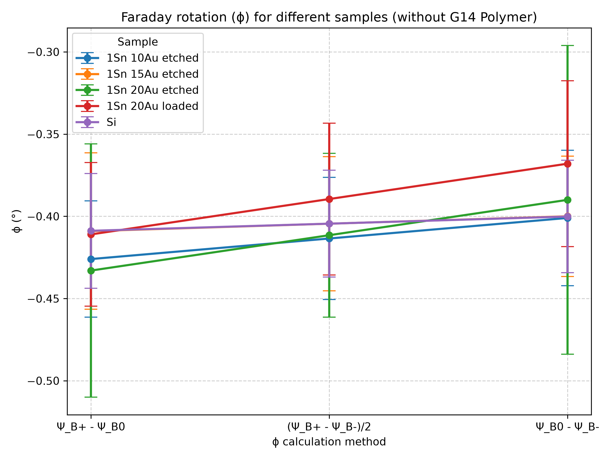

# Faraday rotation from ellipsometry data
This is a repository of scripts that parse ellipsometry data from .txt files, calculate Faraday rotation (FR) three different ways, and returns the values in a table and plot formatted for an excel file.
The calculation of Faraday rotation from the ellipsometric parameter psi is based on the theory outlined by Valeanu et al. [1]
All the samples measured were thin-films (micrometer scale) with a focus on thin-films of nanoparticles (NPs) deposited on a substrate. The experimental data includes measurements on SnO2 core Au shell NPs deposited on an Si substrate.

## Samples 
This script analyses data from the samples data folder. The calculated FR of different samples is plotted with error bars. The first plot visualizes the FR of all the measured thin-films, including polymer, blank Si, and 1SnxAu NPs with different loading ratios (represented by 'x'), being either etched (polymer removed) or loaded (polymer present). It is expected that the polymer on its own should a negligible FR response. [2] Similarly, the FR of blank Si should not be measurable in the visible spectrum. [3] Moreover, FR rotation should increase with increasing volume of Au added (i.e., increasing 'x'). [3] Finally, loaded thin-films of NPs should exhibit greater FR than etched thin-films of NPs. [2]

## Angles 
This script analyses data from the angle data folder. The calculated Faraday rotation of a thin-film of 1Sn15Au nanoparticles for different angles of incidence of 532 nm light is plotted with error bars. 
   

## Si Control
This script is a modifed version of the samples script. It also analyses data from the samples data folder. The calculated FR of from the blank Si sample is substracted from the FR of the SnO2Au samples with different loading ratios. This adjustment of the FR output is done to control for the effect of Si on the FR and elucidate the effect of the NPs on the FR of the sample.

## References 
[1] M. Valeanu, M. Sofronie, A. Galca, F. Tolea, M. Elisa,  bogdan alexandru Sava, L. Boroica, and V. Kuncser, “The relationship between magnetism and magneto-optical effects in rare earth doped aluminophosphate glasses,” Journal of Physics D: Applied Physics 49, 075001 (2016).
[2] A. Miles, Y. Gai, P. Gangopadhyay, X. Wang, R.A. Norwood, and J.J. Watkins, “Improving Faraday rotation performance with block copolymer and FePt nanoparticle magneto-optical composite,” Opt. Mater. Express, OME 7(6), 2126–2140 (2017).
[3] I. Snetkov, and A. Yakovlev, “Faraday isolator based on crystalline silicon for 2-µm laser radiation,” Opt. Lett., OL 47(7), 1895–1898 (2022).
[4]  K. Lewis, R. Arbi, A. Ibrahim, E. Smith, P. Olivera, F. Garza, and A. Turak, “Gold-coated tin oxide nanoparticles as potential optical isolator materials: simulation of absorption and Faraday rotation and comparison with micelle templated core-shell nanoparticles,” J Mater Sci: Mater Electron 34(8), 750 (2023).

